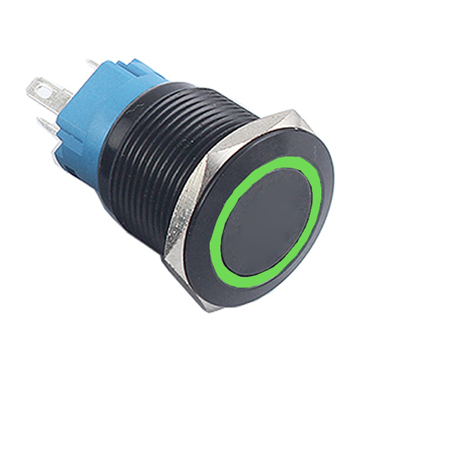
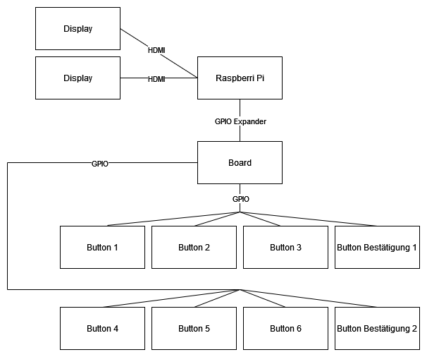

=== Hardware Entscheidungen
Die Hardware Entscheidungen, zeigen auf welche Entscheidungen im Bereich Hardware getroffen worden sind.

==== Nicht einrastende Buttons
Damit immer der Ursprungszustand des Spiels automatisch wiederhergestellt werden kann und kein Primeo Mitarbeit:innen das Spiel in den Ursprungszustand zurücksetzen muss, haben wir uns für nicht einrastende Buttons entschieden. So gehen diese immer wieder in den Standardzustand zurück.

.Nicht einrastender Button

Das spezielle an diesen Buttons ist das sie einen grünen LED Ring haben. Wir zeigen damit auf welche Buttons ausgewählt sind und so eine einfache Zuordnung zu den Antworten existiert.

==== GPIO Raspberry PI
Damit die Buttons am Raspberry Pi angeschlossen und die integrieren LED angesteuert werden können, müssen sie an den GPIO Pins angeschlossen werden. Damit diese Übersichtlich geordnet sind und einfach angeschlossen werden können, haben wir ein Button Expansion Board gebaut. Darauf sind  Schraubklemmen angelötet und mit den Pins des Raspberry Pi verbunden. Dies hat der Vorteil dass bei einem Defekt die Kabel einfach ausgetauscht werden können. Damit die Kabel der Buttons übersichtlich geordnet sind, haben wir ein Flachbandkabel eingesetzt. Nachfolgend wird mit dem Blockdiagramm und Schaltplan der Aufbau gezeigt.

.Blockdiagramm

.Expansion Board
image::../00_images/wire_diagram_prototyp_board.png[]

==== 3D Druck nicht verfügbar
Da der Stand für den 3D Druck zu gross ist, soll auf einen anderen Werkstoff ausgewichen werden. Das Gehäuse besteht aus Holz und Plexiglas und wird mit Nägel, Schrauben und Holzleim zusammengehalten.
Der Oberbau wird aus Schrauben und Heissleim zusammengesetzt. Mit dem Gehäuse aus Holz wird sichergestellt, dass das Produkt sicher vor Beschädigungen ist und Teile einfach ausgetauscht werden können.
