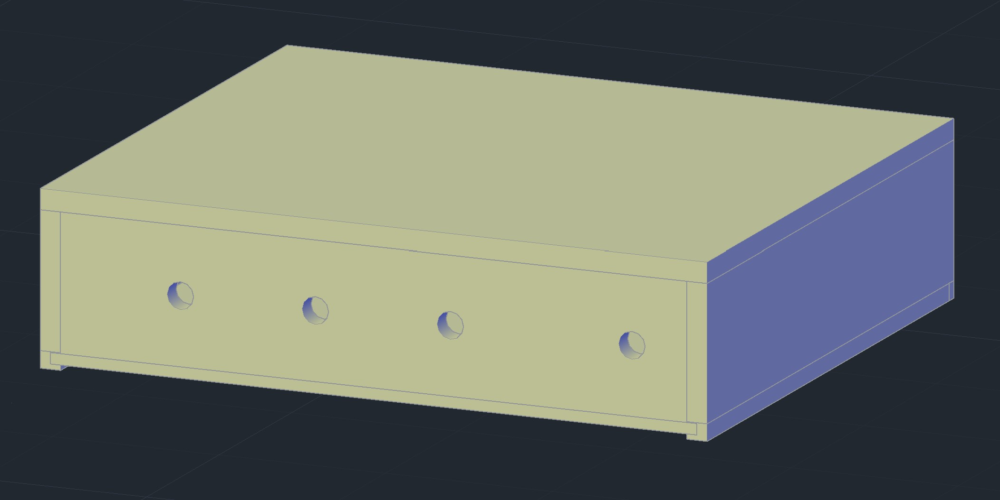
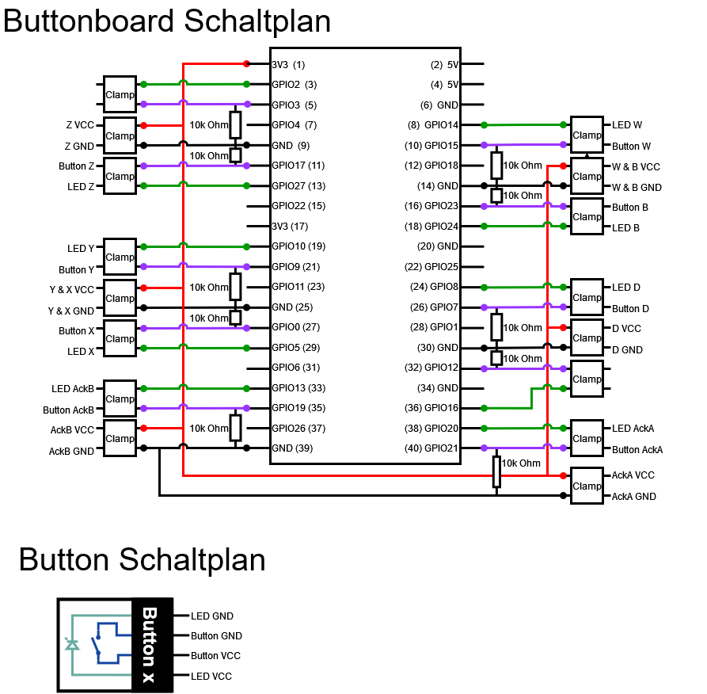

:appendix-caption: Anhang
:example-caption: Beispiel
:figure-caption: Abbildung
:table-caption: Tabelle
:toc-title: Inhaltsverzeichnis
:toc:

= Hardware

[%always]
<<<
[%notitle]
== Hardwareliste
image::Hardwareliste.pdf[pages=1..6]

== Physischer Spielautomat

Der physische Spielautomat umfasst das Gehäuse und die Komponenten.
Der Spielautomat ist so aufgebaut, dass zwei Benutzerkonsolen vorhanden sind.
An diesen können die Benutzer:innen das Spiel steuern und sehen alle Ausgaben des Spiels.

.Physischer Unterbau

Der Spielautomat ist in zwei Teile aufgeteilt. Der Unterbau enthält die Technik mit dem Raspberry Pi, den Buttons und die Stromanschlüsse.
Im Unterbau ist ebenfalls die Stromverteilung an die jeweiligen Komponenten.
Um die ganze Wärme abzuleiten, hat es im Deckel zwei Löcher, bei dem die Wärme abgeleitet wird und die HDMI-Anschlüsse durchgezogen sind.
Der Oberbau beinhaltet die Displays, welche sich hinter dem Plexiglas befinden und leicht angeschrägt sind.
Das Plexiglas verhindert, dass das Display nicht entwendet werden können und die Anschlüsse sicher vor Manipulationen sind.

Nachfolgend sind die genauen Aufbaupläne des Baus:

[%always]
<<<
[%notitle]
=== Schema Spiel
image::schema_spiel.pdf[pages=1..16]

== Schaltplan

Der Schaltplan zeig auf wie die Kompenenten verbunden sind.
Dabei ist der Raspberry Pi mit zwei LCD-Displays verbunden.
Des Weiteren sind die Buttons über ein eigenes gebautes Expansion Board angeschlossen.
Nachfolgend wird der Schaltplan gezeigt:

.Schaltplan Expansion Board

include::../01_general/hardware_decisions.adoc[]

include::../01_general/glossary.adoc[]