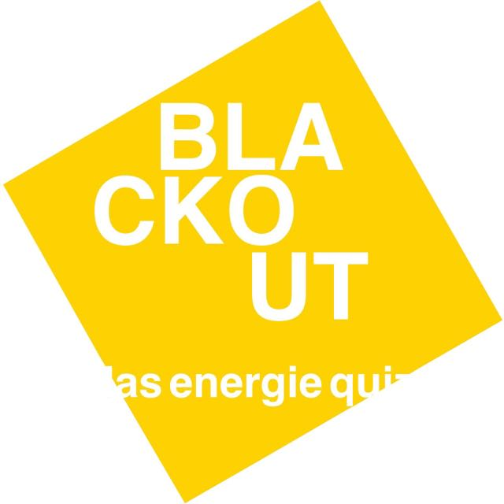

=  Blackout SAD
:revnumber: 0.2 Philip Gertsch und Andri Pieren
:revdate: Mai 2023
:revremark: Stand Assessment 3
:numbered: 1.0.0

Disclaimer: Inhalt teils mit Antworten von ChatGPT (3.5, OpenAI) bearbeitet.

<<<<
include::src/01_introduction_and_goals.adoc[]

<<<<
include::src/02_architecture_constraints.adoc[]

<<<<
include::src/03_system_scope_and_context.adoc[]

<<<<
include::src/04_solution_strategy.adoc[]

<<<<
include::src/05_building_block_view.adoc[]

<<<<
include::src/06_runtime_view.adoc[]

<<<<
include::src/07_deployment_view.adoc[]

<<<<
include::src/08_concepts.adoc[]

<<<<
include::src/09_architecture_decisions.adoc[]

<<<<
include::src/10_quality_requirements.adoc[]

<<<<
include::src/11_technical_risks.adoc[]

<<<<
include::../01_general/glossary.adoc[]
