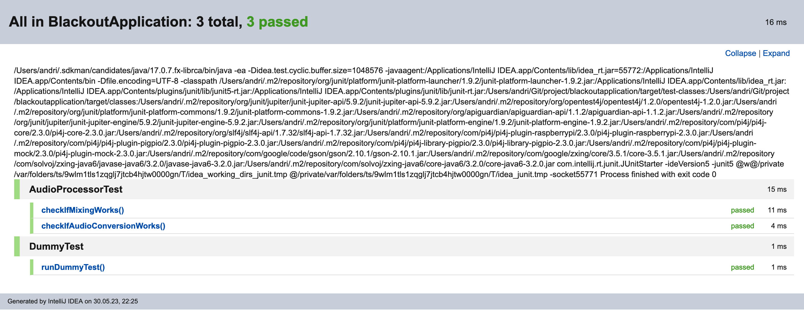

= Testing

== Rahmenbedingungen
Gefordert sind automatische und manuelle Tests. Die automatischen Tests aka Unittest sollen mithilfe der JUnit 5 library geschrieben werden und automatisch ausgeführt werden. Des Weiteren sollen, die automatischen Tests Entwickler unabhängig ausgeführt werden respektive Gitlab (Aussage aus Einführung Source Code IP2). Die manuellen Tests sollen mithilfe einer Vorlage geschrieben werden.
link:https://www.cs.technik.fhnw.ch/confluence20/pages/viewpage.action?pageId=73105886[Siehe Testing]

== Testkonzept
Das Testing verifiziert Komponenten, Teileinheiten oder das ganze Produkt. Dadurch gilt das Testing als Beweis dafür, dass das Produkt die geforderten Anforderungen erfüllt und mit der gewünschten Zuverlässigkeit funktionieren kann. Des Weiteren kann durch das Testing Fehler und Regressionen eines Produktes aufdeckten. Es ist ein wichtiger Bestandteil der Entwicklung. Unser Testingkonzept baut auf den https://www.cs.technik.fhnw.ch/confluence20/display/VT122206/Kritische+Erfolgsfaktoren[Qualitätszielen] und https://www.cs.technik.fhnw.ch/confluence20/display/VT122206/Requirements[Anforderungen] auf.

Aufgrund der genannten Aspekten haben sich folgende Punkte kristallisiert: Testing sollte nach Umsetzung eines Features stattfinden respektive, wenn garantiert ist das eine gewisse Beständigkeit seitens des Features vorhanden ist. Es macht ja keinen Sinn etwas zu testen, welches sich grundlegen ändert und so die doppelte Arbeit zu haben. Daher werden die Tests in der Endphase angepackt, weil vorher die Struktur noch sehr volatil ist. Durch die Rahmenbedingungen ist gefordert, dass automatische Tests und manuelle Test eingesetz werden müssen. Aufgrund der Gegebenheiten werden die automatischen Tests aka Unittest den Code abdecken und die manuellen Tests das ganze Spiel, die Hardware und die Benutzeroberfläche. Anmerkung die manuellen Tests sollen die Funktionsweise und nicht die Usability testen, denn dafür werden separate Usability Test durchgeführt.

=== Unittests
Unittest sollen kleine Komponenten testen (bsp. Methoden). Anhand des Features werden alle Komponenten des Features separat in eine Unittest überprüft. Diese Tests werden automatisch durch eine Pipeline ausgeführt (Eine Pipeline ist eine fest definiert Reihenfolgen von Operationen, welche nach eine Event bspw. einem Push ausgeführt wird, (Siehe mehr bei der Dev Dokument) oder können manuell von einem Entwickler lokal angestossen werden um frühzeitig Regressionen oder Fehler zu entdecken.
Dafür sollen sie folgendermassen aufgebaut sein:

* Sprechender und sinnvollen Namen (der Name soll beschreiben, was der Testfall macht)
* Für Argumente sollen Mocks oder kontrollierte Daten übergeben werden
* Einheiten oder Methoden, welche getestet werden müssen
* Der Testfall soll nach dem "Given When Then Pattern" aufgebaut sein
* Eine Behauptung anwenden
* Sie müssen isoliert durchführbar sein
* Die Vor- und Nachbedingungen sollen aus dem Kommentar der zu testenden Methoden abgeleitet werden

.Beispiel Java
[source,java]
----
public class Tests {
  @Test
  public void testisOverdrawnBalance500AssertTrue() throws Throwable {
    // Given
    Customer customer = mockCustomer();
    int initialBalance = 0;
    Account underTest = new Account(customer, initial_balance);

    // When
    int balance = -500;
    boolean result = underTest.isOverdrawn(balance);

    // Then
    assertTrue(result);
  }
}
----

*Hilfe Unittests*

Damit das Schreiben der Test einfacher ist und der Norm entspricht, gibt es im Entwickler Projekt ein Template dazu.

* Dateien -> UnitTest (Erstellt eine Unittestdatei)
* Methode -> uTest (Erstellt ein Testmethode)

Dev Unittest templates [Detaillierter Beschreib der Templates]

Der folgende
https://de.parasoft.com/blog/how-to-write-test-cases-for-software-examples-tutorial/[Blogeintrag von Parasoft "How to write test case for software examples tutorial"] diente als Basis für das Konzept.

=== Manuelle Tests
Manuelle Tests testen das ganze Spiel, spezifische Hardware des Produktes und die Benutzeroberfläche des Produktes. Sie sollen folgende Informationen umfassen:

* Testfall-ID
* Testbeschreibung
* Vorbedingungen
* Testdaten
* Schritte
* erwartetes Ergebnis/Nachbedingung
* Pass/Fail

Dafür sind in IntelliJ Templates vorhanden, welches als Vorlage verwendet werden können (Test->TestCase und Testrun->Testrun). Zuerst muss der Test als *TestCase* erstellt werden, danach kann ein *Testrun* erstellt werden, welche den Durchlauf des Tests darstellt und in einem Testmandat gruppiert wird. Diese Testmandate werden dann vom Tester als Packet durchgeführt.

== Testplan
Der Testplan sieht vor, dass sobald eine gewisse Beständigkeit herrscht, das ist gegen Schluss des Projektes, die Test geschrieben und geprüft werden. Dabei wird zwischen Unit- und manuelle Tests unterschieden. Die Manuellen Tests sind die Abnahmetests.

=== Testpakete
Die Testfälle der Unit und Manuellen Tests/Abnahmetest wurden in Pakete eingeteilt. Diese Pakete dienen zur besseren Verwaltung.

.Testpakete
[%autowidth, options="header"]
|===
|Paket | Beschreibung | Autor
|Unittest: Audio | Audiofunktionalität testen | Andri Pieren
|Unittest: Wechsel Statemachine | Wechsel der einzelnen Screens testen | Andri Pieren
|Unittest: Team | Die Funktionalität für den Teammodus testen | Philip Gertsch
|Unittest: Einzel | Die Funktionalität für den Einzelmodus testen | Philip Gertsch
|Unittest: Quiz | Die Funktionalität für das Laden des Quizzes testen | Sabrina
|Unittest: QR-Code | Die Funktionalität für das Erstellen des QR Code testen | Sabrina
|Manuelle Test: Config | Die Applikation konfigurieren | Andri Pieren
|Manuelle Test: Versus | Den Teammodus ganz durchspielen testen | Andri Pieren
|Manuelle Test: Einzel | Den Einzelmodus ganz durchspielen | Andri Pieren
|===

=== Testplan Unittest
Der Testplan Unittest zeigt auf bis wann die einzelnen Pakete umgesetzt für die Unittests umgesetzt sind.

.Testplan Unittest
[%autowidth, options="header"]
|===
|Datum | Paket
|31.05.2023 |Unittest: Audio -> erreicht
|31.05.2023 |Unittest: Wechsel Statemachine -> nicht erreicht
|31.05.2023 |Unittest: Team -> nicht erreicht
|31.05.2023 |Unittest: Einzel -> nicht erreicht
|31.05.2023 |Unittest: Quiz -> nicht erreicht
|31.05.2023 |Unittest: QR-Code -> nicht erreicht
|===

Resultat der Unittests::

=== Testplan Manuelle Test
Der Testplan Manuelle Test zeigt auf bis wann die einzelnen Pakete umgesetzt für die Manuellen Test umgesetzt sind.

.Testplan Unittest
[%autowidth, options="header"]
|===
|Datum | Paket
|30.05.2023 |Manuelle Test: Config
|30.05.2023 |Manuelle Test: Versus
|30.05.2023 |Manuelle Test: Einzel
|===

=== Testmandat der Abnahmetest/Manuellen Test
Die Testmandate sind die Durchläufe der Manuellen Tests, welche den Personen zugeordnet sind. Diese Personen führen in ihrem Testmandat den Testfall für das definierte Paket durch.

==== Testmandate: Paket «Manuelle Test: Config» (bis und mit 31.05.2023)

===== Testmandat
.Testmandat A (Andri)
[%autowidth, options="header"]
|===
|Datum | Testrun | Result | Link
|30.05.2023 | Philip und Andri | ✅ a|link:test_runs/system_check_run_31_Mai.adoc[Testrun]
|===

include::test_runs/system_check_run_31_Mai.adoc[]

==== Testmandate: «Manuelle Test: Versus» (bis und mit 31.05.2023)

.Testmandat A (Andri)
[%autowidth, options="header"]
|===
|Datum | Testrun | Result | Link
|30.05.2023 | Philip und Andri | ✅ a|link:test_runs/versus_run_31_Mai.adoc[Testrun]
|===

include::test_runs/versus_run_31_Mai.adoc[]

==== Testmandate: «Manuelle Test: Einzel» (bis und mit 31.05.2023)

.Testmandat A (Andri)
[%autowidth, options="header"]
|===
|Datum | Testrun | Result | Link
|30.05.2023 | Philip und Andri | ✅ a|link:test_runs/einzel_run_31_Mai.adoc[Testrun]
|===

include::test_runs/einzel_run_31_Mai.adoc[]

